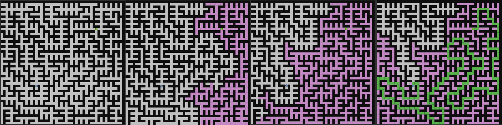

# ROS 2 Path Planning

Este es un workspace de ROS 2 que se utiliza para la planificación de rutas utilizando los algoritmos BFS, GREEDY y ASTAR. El paquete `planification` contiene los nodos y scripts necesarios para generar mapas y ejecutar la planificación de rutas.

## Requisitos

- ROS 2 Foxy o superior (En mi caso he utilizado ROS 2 GALACTIC)
- Python 3


## Instalación

Asegúrate de que tengas ROS 2 instalado y configurado correctamente en tu sistema. Luego, clona este repositorio en tu espacio de trabajo de ROS 2 y compila los paquetes.

```bash
git clone https://github.com/fervh/ROS-2-Path-Planning.git

cd ws

source /opt/ros/galactic/setup.bash

colcon build --symlink-install

source install/local_setup.bash
```

## Uso

### Generar un Mapa

Para generar un mapa, utiliza el siguiente comando:
```bash
cd ws/src/planification/data
python3 generate_map.py --map map12.csv --rows 50 --columns 50
```
Este comando generará un archivo CSV llamado map12.csv con 50 filas y 50 columnas. Puedes ajustar los valores de `--map` , `--rows` y `--columns` según tus necesidades.

### Ejecutar la Planificación de Rutas

Para ejecutar la planificación de rutas con un algoritmo específico, utiliza el siguiente comando:
```bash
ros2 launch planification general.launch.py csv_file:=map12.csv mode:=bfs sleep_time:=0.01
```
Asegúrate de reemplazar `bfs` con el algoritmo que deseas utilizar: `bfs`, `greedy` o `astar`. Puedes ajustar el valor de `sleep_time` según tus preferencias (utiliza un float).

Una vez ejecutado, puedes utilizar `Publish Point` para establecer los puntos de inicio y final de la ruta


### Ejemplo de la Planificación de Rutas

[VIDEO EJEMPLO](media/video1.mp4)

## Comparación de Tiempos y Eficiencia de los distintos Algoritmos

A continuación se hace una comparación de los tres algoritmos de búsqueda: BFS (Breadth-First Search), A* y Greedy, en varios mapas. Los tiempos de ejecución se presentan a continuación, además los puedes encontrar en el archivo siguiente archivo [EXCEL](media/comparaciondetiempos.ods).

|       | BFS                                                                   | A STAR                                                                | GREEDY                                                                |
| ----- | --------------------------------------------------------------------- | --------------------------------------------------------------------- | --------------------------------------------------------------------- |
| map01 | Time=0.0094 ; Start Point= (1.50, 8.50) ; End Point = (1.50, 1.50)    | Time=0.0072 ; Start Point= (1.50, 8.50) ; End Point = (1.50, 1.50)    | Time=0.0069 ; Start Point= (1.50, 8.50) ; End Point = (1.50, 1.50)    |
| map02 | Time=0.0162 ; Start Point= (8.50, 9.50) ; End Point = (1.50, 3.50)    | Time=0.0148 ; Start Point= (8.50, 9.50) ; End Point = (1.50, 3.50)    | Time=0.0088 ; Start Point= (8.50, 9.50) ; End Point = (1.50, 3.50)    |
| map03 | Time=0.0817 ; Start Point= (15.50, 5.50) ; End Point = (9.50, 5.50)   | Time=0.0785 ; Start Point= (15.50, 5.50) ; End Point = (9.50, 5.50)   | Time=0.0363 ; Start Point= (15.50, 5.50) ; End Point = (9.50, 5.50)   |
| map04 | Time=0.1271 ; Start Point= (15.50, 5.50) ; End Point = (9.50, 5.50)   | Time=0.1148 ; Start Point= (15.50, 5.50) ; End Point = (9.50, 5.50)   | Time=0.0945 ; Start Point= (15.50, 5.50) ; End Point = (9.50, 5.50)   |
| map05 | Time=0.2032 ; Start Point= (13.50, 5.50) ; End Point = (11.50, 5.50)  | Time=0.1502 ; Start Point= (13.50, 5.50) ; End Point = (11.50, 5.50)  | Time=0.0558 ; Start Point= (13.50, 5.50) ; End Point = (11.50, 5.50)  |
| map06 | Time=0.0455 ; Start Point= (18.50, 9.50) ; End Point = (1.50, 3.50)   | Time=0.0266 ; Start Point= (18.50, 9.50) ; End Point = (1.50, 3.50)   | Time=0.0203 ; Start Point= (18.50, 9.50) ; End Point = (1.50, 3.50)   |
| map12 | Time=1.6096 ; Start Point= (48.50, 48.50) ; End Point = (0.50, 0.50)  | Time=1.6062 ; Start Point= (48.50, 48.50) ; End Point = (0.50, 0.50)  | Time=0.7610 ; Start Point= (48.50, 48.50) ; End Point = (0.50, 0.50)  |
| map13 | Time=3.5658 ; Start Point= (98.50, 98.50) ; End Point = (98.50, 0.50) | Time=2.8666 ; Start Point= (98.50, 98.50) ; End Point = (98.50, 0.50) | Time=0.6504 ; Start Point= (98.50, 98.50) ; End Point = (98.50, 0.50) |

En general, los resultados indican que el algoritmo Greedy es el más rápido en todos los mapas, seguido por A*, y finalmente BFS es el más lento.

1. Greedy Search:

    Greedy Search es el más rápido de los tres porque toma decisiones en función de la heurística de búsqueda y busca la solución que parece más prometedora en cada paso.
    Sin embargo, Greedy Search no garantiza que se encuentre la solución óptima, ya que puede quedar atrapado en mínimos locales.

2. A*:

    A* utiliza una combinación de la función de costo acumulado hasta el momento (g) y una heurística (h/f) para tomar decisiones. 
    A* es más lento que Greedy Search porque necesita considerar un número mayor de nodos en su búsqueda, pero a menudo es más rápido que BFS para encontrar soluciones óptimas, ya que utiliza información heurística para dirigir la búsqueda hacia el objetivo.

3. Breadth-First Search (BFS):

    BFS es el más lento de los tres porque explora sistemáticamente todos los nodos en un nivel antes de avanzar al siguiente nivel. Esto garantiza que encuentre una solución óptima si existe, pero puede ser muy ineficiente en términos de tiempo y memoria, especialmente en espacios de búsqueda grandes (tal y como se aprecia en el mapa más grande, el map13).